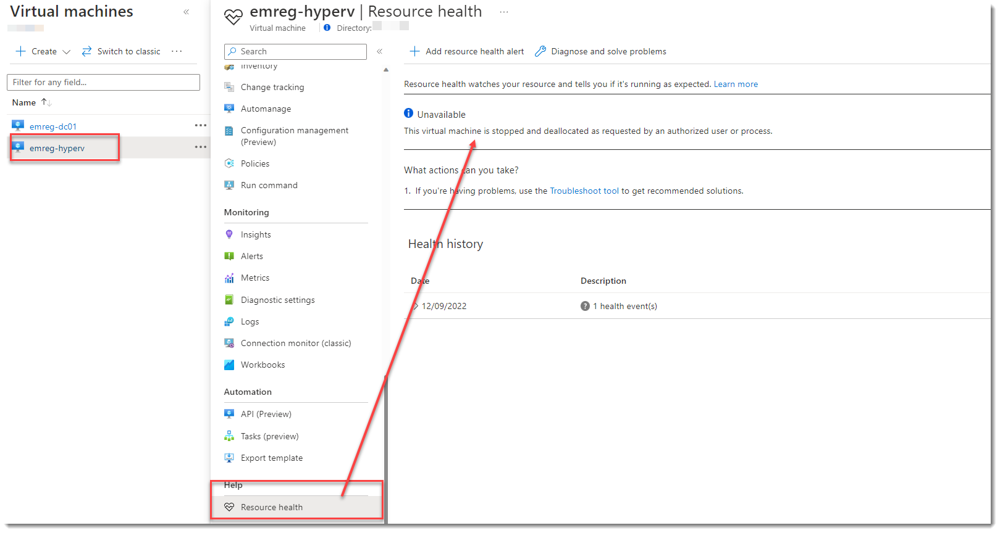

# Enable Resource Health Alerts

## Overview

Resource health is by default enabled on [certain resources](https://learn.microsoft.com/en-us/azure/service-health/resource-health-checks-resource-types) but alerting is not!



You dont need to enable anything to figure out the health. Its already there but you need to create Alerts.

At the end of the post you will find the solution that you can go ahead and start using it.

## Understand Alert Creation & Best practice

Alert creation can be created in two ways;

- **_Manually using portal:_** This can be a way to learn the experience but does not scale. Imagine you need to create resource health alerts for 100 web apps. Good luck with that! I wont cover this in this tutorial its basic, each resource has resource health tab and then create reasource health wizzard, yes just follow the wizzard, you are good to go!
- **_Creating alerts programatically:_** this might be best way in enterprises, it also fits into DevOps pipelines. We need Arm and **_PowerShell_** for this!

Okay. We decided on the Programmatic way ? lets continue...

## Programatic way of Creating Resource Health Alerts

As we discussed earlier, it will be arm and powershell but before diving into the code sample and details lets decide our scope.

We can create an alert rule that is scoped on;

- **_Subscription based:_** In this case all the resources that supports resource health will alert. I wouldnt recommend this one as it will generate noise for the resources that are not that critical.
- **_Resource based:_** We can specify each resource and add the resourceids in our scope. Well.. I would only recommend this if you can manage the ids with an outer programatic way and solution. This can be applicable only if you really need and requires additional code and maintenance effort and probably a good tag management...
- **_Resource Type Based:_** _I think this is a great point to start._ It is **best of both worlds**. Choose your critical resource types and enable the alerting based on resource those resource types.

I suggest to start with the Resource Type based approach and as a second phase move to resource based with a solution which should be super&uber dynamic. Probably a script that is based on tags..

> **_Note:_** In this code sample I will go with the Resource Type Based scenario.

## Using Templates

### Resource Health Alerts For ResourceTypes

Use [ResourceHealthAlertsForResourceTypes Template](./ArmTemplates/ResourceHealthAlertsForResourceTypes.json) for deploying resource health alert rules for;

- Alerts on Failures (CurrentStatus: Unavailable or Degraded)
- Does not include user initiated outages, only platform ones.

_Things to consider and change if desired;_

- Change the following section of the template to desired `Resource Types` please see the overview section in this document for supported resource types.

```Json
                            "anyOf": [
                                {
                                    "field": "resourceType",
                                    "equals": "Microsoft.web/serverFarms",
                                    "containsAny": null
                                },
                                {
                                    "field": "resourceType",
                                    "equals": "Microsoft.web/sites",
                                    "containsAny": null
                                }

                            ]
```

There's a parameter json here

Running the template is easy.

```PowerShell
cd ./ArmTemplates
$ResourceGroup = 'ContosoAll'
$DeploymentName  = 'ResourceHealthAlertRuleDeployment'
$TemplateFilePath = './ResourceHealthAlertsForResourceTypes.json'
$TemplateParameterFile = './ResourceHealthAlertsForResourceTypes.Parameters.json'
New-AzResourceGroupDeployment -Name $DeploymentName -ResourceGroupName $ResourceGroup `
  -TemplateFile $TemplateFilePath  `
  -TemplateParameterFile $TemplateParameterFile
```
